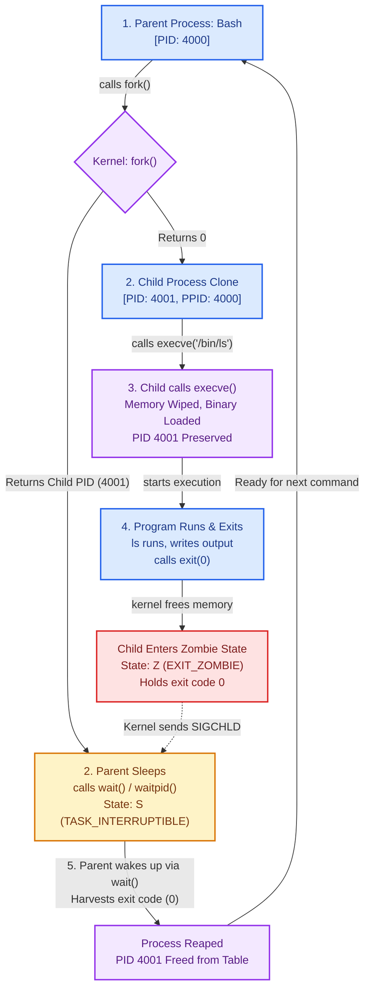

# Day 1: Linux Process Fundamentals & Lifecycle

> **Portfolio Learning Log — Day 1**  
> **Topic:** Linux Process Fundamentals, Memory Isolation & Execution Lifecycle  

---

## 📌 Quick Summary of the Day
Today I kicked off my deep dive into Linux systems internals. The goal was to understand what actually happens behind the scenes when a program executes in Linux, how the kernel handles CPU and memory isolation, how processes are born and transformed (`fork` + `execve`), and why PID 1 behaves so uniquely.

After learning the theory, I built hands-on lab scripts to inspect `/proc`, reproduce process forking and orphan reparenting in real time, and verify file descriptor behavior across `execve()`.

---

# Part 1: What I Learnt Today

## 1. Programs vs. Processes
* **Programs are executable code stored on disk in a file.** They are passive blueprints (like a `.exe` on Windows or an ELF binary on Linux). They take up disk space, not CPU or RAM.
* **A process is a live execution.** When you run a program, the kernel loads it into memory, and it becomes an active, living instance.
* **Instance is process:** The core mental model to remember is that an instance of a running program is a process.
* **1 program can have multiple processes:** You can launch multiple instances of the exact same binary (e.g., three different terminal windows or multiple background workers).
* **Each process has a different PID (Process ID):** Every running instance gets assigned its own unique numeric identifier by the kernel.
* **PIDs can be reused:** When a process exits and its exit code is harvested by its parent, its PID is returned to the pool and can be reassigned to a new process later.

---

## 2. What the Kernel Tracks for Every Process
The Linux kernel maintains a dedicated bookkeeping structure for every single process on the system (the `task_struct` / Process Control Block):
* **PID & PPID:** The process's own ID (`PID`) and its parent's process ID (`PPID`).
* **UID & Group ID:** User ID and Group ID defining ownership and access permissions.
* **Virtual Memory:** The private virtual address space mapped for that specific process.
* **FD (File Descriptors):** Pointers to open files, standard streams (`0` stdin, `1` stdout, `2` stderr), pipes, and network sockets.

---

## 3. CPU Handling and Memory

### The Scheduler: Traffic Police
* A completely fair scheduler (CFS) or **EEVDF** (Earliest Eligible Virtual Deadline First in Linux 6.6+) is like **traffic police**.
* It decides which process gets into the CPU, lands on which core, and how many milliseconds it gets to run.
* It prioritizes which process to run based on high priority, urgency, and virtual deadlines so no process starves.

### Virtual Memory: The Isolation Illusion
* **A process never talks directly to your physical RAM.**
* Instead, the kernel gives each process its own **virtual address space**—an illusion making the process believe it has the entire memory range all to itself.
* The kernel and the CPU's MMU (Memory Management Unit) secretly translate those virtual addresses into physical RAM locations on the fly.
* **Every single process has its own separate virtual address space.** Process A cannot see or corrupt Process B's memory because their virtual addresses map to completely different physical pages.

---

## 4. Process Creation: `fork()`

Processes don't just appear out of thin air:
* When we run a program, the current process (Bash) **clones itself** into a parent (Bash) and a child (Bash).
* The parent Bash goes into sleep and waits for the child process to finish.
* The child Bash wipes its Bash brain, loads the command into its memory, and our desired program runs.
* Then the program finishes and exits, and the parent Bash wakes up ready for the next command.

### The Two Core Actions:
* **`fork` $\to$ Bash clones itself:** 
  * `fork()` creates an exact duplicate of the parent process.
  * In the **Child**, `fork()` returns `0`.
  * In the **Parent**, `fork()` returns the **Child's PID** (e.g. `3721`) so the parent can track and wait on it.
* **`exec` $\to$ Child process replaces its memory with a new program:**
  * The child process swaps its memory image with the new binary.
  * **The PID stays the same.**

---

## 5. `execve()`

### What `execve()` Does:
* Wipes the calling process memory (code, stack, heap) and loads a new binary in its place.
* **Does not create a new process:** The PID and PPID remain identical before and after.
* `exec()` only wipes out code and data, but **it will keep environment variables and open file descriptors** (unless `O_CLOEXEC` is set).

### Demystifying Return Values:
* `execve()` **never returns on success** because the original code has been wiped from memory. The CPU immediately begins executing the `main()` function of the new program.
* `execve()` only returns if it encounters an error (returning `-1`).
* When the child process finishes its work, it calls `exit(0)`. The `0` is its exit status code, which the sleeping parent reaps via `wait()`.

---

## 6. Process Lifecycle Loop (Visualized)

Here is the exact cycle that happens when running a command in a shell:



---

## 7. PID 1

### What is PID 1?
* **The 1st user-space process started by the kernel** at boot time (typically `systemd` or `/sbin/init`).
* **PID 1 is the parent of all processes:** Every process hierarchy traces back to PID 1.
* The kernel treats PID 1 differently from everything else on the system.

### Orphan Adoption & Zombie Prevention:
* If a parent dies or crashes while its child is still running, that child becomes an **orphan**.
* **Linux doesn't kill the child:** Instead, it **reparents the orphan to PID 1** (or a designated ancestor subreaper). PID 1 becomes its new legal guardian.
* **PID 1 reads orphan exit codes immediately:** It runs a continuous reaper loop so dead child processes don't get stuck as permanent zombies.
* **Immunity:** PID 1 is immune to `sudo kill -9 1`. The kernel ignores unhandled signals sent to PID 1 to protect the OS from crashing.

---

## 8. Production & SRE Context: Containers & PID 1

Understanding these concepts is critical in modern container and cloud environments:

* **The Docker PID 1 Trap:** When you run a container (e.g. `CMD ["node", "server.js"]`), your application becomes **PID 1 inside that container**.
* **Zombie Leaks:** Standard applications (Node, Python, Java) do not implement process reaping loops. If child workers crash or spawn orphaned grandchildren, those orphans reparent to PID 1 (`node`). When they exit, they remain stuck as zombies (`<defunct>`).
* **Host PID Exhaustion:** Containers share the host kernel. As zombies accumulate, they consume entries in `/proc/sys/kernel/pid_max`. Once full, **the entire host crashes**—no new processes can fork, and SSH fails with `Resource temporarily unavailable`.
* **Signal Handling Failures:** The kernel does not apply default signal handling to PID 1. If your app doesn't explicitly listen for `SIGTERM`, it ignores stop requests. After a 10s timeout, Docker issues a brutal `SIGKILL`, corrupting database writes and active connections.
* **The Fix (Init Wrappers):** Use `tini`, `dumb-init`, or Docker's `--init` flag. They run as PID 1, properly forward signals, and automatically reap zombie children.

---

## 9. Key Gotchas: Orphans vs. Zombies & `O_CLOEXEC`

### Orphan vs. Zombie
| Attribute | Orphan Process | Zombie Process (`<defunct>`, State `Z`) |
| :--- | :--- | :--- |
| **Is it alive?** | **Yes.** Actively executing code, using CPU/RAM. | **No.** Already terminated and dead. |
| **Memory** | Has full virtual address space. | Zero memory (code and stack freed). |
| **Parent State** | Biological parent is **dead**. | Parent is **alive**, but forgot to call `wait()`. |
| **Kernel State**| Reparented to PID 1 / subreaper. | Minimal entry in Process Table holding exit code. |
| **Can you kill it?**| Yes, via `kill <PID>`. | **No.** `kill -9` does nothing because it's already dead. |

### File Descriptors & `O_CLOEXEC`
* File descriptors survive `execve()` by default!
* If a parent opens sensitive credentials or sockets and calls `execve()` without closing them, the child inherits open access to those descriptors.
* **The fix:** Always use the `O_CLOEXEC` flag when opening file descriptors.

---

# Part 2: What I Did Today (Terminal Labs & Proof of Work)

To verify all these concepts with real data, I built and ran reproducible experiments in Ubuntu Linux:

### Lab 1: Inspecting Process Anatomy via `/proc`
I wrote [`lab/inspect_proc.sh`](./lab/inspect_proc.sh) to directly inspect the virtual filesystem the kernel exposes for the running process:

```console
$ ./lab/inspect_proc.sh
==========================================
   PROCESS INSPECTION LAB (PID: 5702)       
==========================================

[1] Command Line (/proc/5702/cmdline):
/bin/bash ./lab/inspect_proc.sh 

[2] Key Process Attributes (/proc/5702/status):
Name:	inspect_proc.sh
State:	S (sleeping)
Pid:	5702
PPid:	5700
Uid:	1000	1000	1000	1000
Gid:	1000	1000	1000	1000
FDSize:	256
VmSize:	    4948 kB
VmRSS:	    3684 kB

[3] Open File Descriptors (/proc/5702/fd):
lr-x------ 1 abir abir 64 Sep 11 03:49 0 -> pipe:[34388]
l-wx------ 1 abir abir 64 Sep 11 03:49 1 -> pipe:[34389]
l-wx------ 1 abir abir 64 Sep 11 03:49 2 -> pipe:[34390]
lr-x------ 1 abir abir 64 Sep 11 03:49 255 -> ./lab/inspect_proc.sh
```
> **What I verified:** The kernel exposes live process metadata directly in `/proc/<PID>/`. I inspected the active PID, biological PPID, memory usage (`VmSize`/`VmRSS`), and open file descriptors.

---

### Lab 2: Forking, Child PID Tracking & Orphan Adoption
I wrote [`lab/orphan_demo.py`](./lab/orphan_demo.py) (and [`lab/orphan_demo.sh`](./lab/orphan_demo.sh)) to test process cloning and watch the kernel reparent an orphan when its parent terminates prematurely:

```console
$ python3 lab/orphan_demo.py
=================================================================
[*] [Supervisor: 5718] Starting process lifecycle experiment
=================================================================
[*] [Parent:     5725] Worker Parent running. Calling os.fork() to spawn child...
[+] [Parent:     5725] fork() returned Child PID: 5726
[+] [Parent:     5725] Parent will now EXIT IMMEDIATELY without calling wait().
[+] [Parent:     5725] Child 5726 is now an orphan!
[+] [Child:      5726] Child created! Biological Parent PPID: 5725 ('python3')
[+] [Child:      5726] Waiting for Biological Parent (5725) to terminate...
[*] [Supervisor: 5718] Observed Worker Parent 5725 exit cleanly.
-----------------------------------------------------------------
[!] [Child:      5726] Biological Parent died! Querying kernel for new PPID...
[!] [Child:      5726] Adoptive Parent PPID: 5717
[!] [Child:      5726] Guardian Name: 'Relay(5718)' (PID: 5717)
=================================================================
[*] [Supervisor: 5718] Experiment completed successfully.
```
> **What I verified:** 
> 1. `fork()` returned `Child PID: 5726` to the parent, while the child started with biological parent `PPID: 5725`.
> 2. When the parent exited immediately, the child did not die.
> 3. The Linux kernel instantly reparented the running child to its new adoptive legal guardian (`PID 5717` — the active system subreaper).

---

### Lab 3: Proving File Descriptor Survival & `O_CLOEXEC`
I wrote [`lab/fd_cloexec_demo.py`](./lab/fd_cloexec_demo.py) to prove that file descriptors leak across `execve()` unless `O_CLOEXEC` is explicitly set:

```console
$ python3 lab/fd_cloexec_demo.py
==================================================
   FILE DESCRIPTOR INHERITANCE ACROSS EXECVE()    
==================================================
Parent process PID: 5751
FD 3 -> /tmp/leaked_secret.txt (Inheritable: True)
FD 4 -> /tmp/closed_secret.txt (Inheritable: False)

Calling os.execve() to replace memory with '/bin/ls -l /proc/self/fd'...
total 0
lr-x------ 1 abir abir 64 Sep 11 03:49 0 -> pipe:[38018]
l-wx------ 1 abir abir 64 Sep 11 03:49 1 -> pipe:[38019]
l-wx------ 1 abir abir 64 Sep 11 03:49 2 -> pipe:[38020]
lrwx------ 1 abir abir 64 Sep 11 03:49 3 -> /tmp/leaked_secret.txt
lr-x------ 1 abir abir 64 Sep 11 03:49 4 -> /proc/5751/fd
```
> **What I verified:** FD 3 (`/tmp/leaked_secret.txt`) survived the `execve()` memory wipe and remained wide open in the new binary. FD 4 (marked with `O_CLOEXEC` / `inheritable=False`) was automatically closed by the kernel.

---

### Lab 4: Testing PID 1 Immunity to `kill -9`
I ran a test directly as root against PID 1 (`systemd`):
```console
# kill -9 1
# ps -p 1 -o pid,stat,comm
    PID STAT COMMAND
      1 Ss   systemd
```
> **What I verified:** Even with root privileges (`UID 0`), `SIGKILL` sent to PID 1 was silently discarded by the kernel. PID 1 remained running in state `Ss`.

---

## 🛠️ Lab Scripts Created in this Repo

| Script | Purpose |
| :--- | :--- |
| **[`lab/inspect_proc.sh`](./lab/inspect_proc.sh)** | Bash script inspecting `/proc/$$` (`status`, `cmdline`, `fd`, `maps`). |
| **[`lab/orphan_demo.py`](./lab/orphan_demo.py)** | Python script demonstrating `os.fork()`, premature parent exit, and kernel reparenting. |
| **[`lab/orphan_demo.sh`](./lab/orphan_demo.sh)** | Pure Bash orphan reparenting test using `/proc/$BASHPID/status` kernel inspection. |
| **[`lab/fd_cloexec_demo.py`](./lab/fd_cloexec_demo.py)** | Script proving file descriptor inheritance across `execve()` and `O_CLOEXEC` protection. |

To run any of the labs:
```bash
chmod +x lab/*.sh lab/*.py
./lab/inspect_proc.sh
python3 lab/orphan_demo.py
bash lab/orphan_demo.sh
python3 lab/fd_cloexec_demo.py
```

---

## 📌 Key Takeaways for Day 1
1. **Programs are passive blueprints on disk; processes are living instances in RAM.**
2. **CPU schedulers act like traffic police; virtual memory gives every process the illusion of exclusive RAM.**
3. **`fork()` clones; `execve()` wipes and replaces code while keeping the same PID.**
4. **PID 1 is the first user-space process started by the kernel, immune to `kill -9`, and the adoptive parent of all orphaned processes.**
5. **Never run unmonitored apps as PID 1 in containers without an init wrapper like `tini` or `dumb-init` to prevent zombie leaks and host PID exhaustion.**
