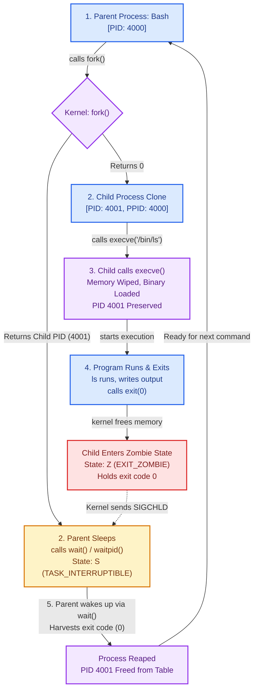

# Day 1: Linux Process Fundamentals & Lifecycle

Personal study notes and lab experiments covering process mechanics, kernel accounting (`task_struct`), memory isolation, the Bash execution loop (`fork` + `execve`), and PID 1 edge cases.

---

## Overview
Notes from Day 1 exploring Linux process internals: how programs execute, how the kernel handles CPU scheduling and virtual memory isolation, how `fork()` and `execve()` transform processes, and why PID 1 behaves differently from normal processes.

---

# Part 1: What I Learnt Today

## 1. Programs vs. Processes
* **Programs are executable code stored on disk in a file.** They are passive blueprints (like a `.exe` on Windows or an ELF binary on Linux). They take up disk space, not CPU or RAM.
* **A process is a live execution.** When you run a program, the kernel loads it into memory, and it becomes an active, living instance.
* **Instance is process:** An instance of a running program is a process.
* **1 program can have multiple processes:** You can launch multiple instances of the exact same binary (e.g., three terminal windows or multiple background workers).
* **Each process has a different PID (Process ID):** Every running instance gets assigned its own unique numeric identifier by the kernel.
* **PIDs can be reused:** When a process exits and its exit code is harvested by its parent, its PID returns to the available pool and can be reassigned later.

---

## 2. What the Kernel Tracks for Every Process
The Linux kernel maintains a dedicated bookkeeping structure for every process on the system (the `task_struct` / Process Control Block):
* **PID & PPID:** The process's own ID (`PID`) and its parent's process ID (`PPID`).
* **UID & Group ID:** User and Group IDs defining ownership and permissions.
* **Virtual Memory:** The private virtual address space mapped for that process.
* **FD (File Descriptors):** Pointers to open files, standard streams (`0` stdin, `1` stdout, `2` stderr), pipes, and sockets.

---

## 3. CPU Handling and Memory

### The Scheduler: Traffic Police
* A completely fair scheduler (CFS) or **EEVDF** (Earliest Eligible Virtual Deadline First in Linux 6.6+) acts like **traffic police**.
* It decides which process gets CPU time, lands on which core, and how many milliseconds it gets to run.
* It prioritizes which process to run based on priority, urgency, and virtual deadlines so no process starves.

### Virtual Memory: The Isolation Illusion
* **A process never talks directly to physical RAM.**
* Instead, the kernel gives each process its own **virtual address space**—an illusion that the process has the entire memory range to itself.
* The kernel and the CPU's MMU (Memory Management Unit) translate those virtual addresses into physical RAM locations on the fly.
* **Every process has its own separate virtual address space.** Process A cannot see or corrupt Process B's memory because their virtual addresses map to completely different physical pages.

---

## 4. Process Creation: `fork()`

Processes don't come out of thin air:
* When running a program, the current shell (Bash) **clones itself** into a parent (Bash) and a child (Bash).
* The parent Bash goes to sleep and waits for the child to finish.
* The child Bash wipes its memory, loads the command binary into its space, and executes it.
* Once the program finishes and exits, the parent Bash wakes up, reaps the status, and prepares for the next command.

### The Two Core Actions
* **`fork()` clones the process:**
  * In the **Child**, `fork()` returns `0`.
  * In the **Parent**, `fork()` returns the **Child's PID** (e.g. `3721`) so the parent can track and wait on it.
* **`exec()` replaces memory with a new program:**
  * The child swaps its memory image with the target binary.
  * **The PID stays the same.**

---

## 5. `execve()`

### What `execve()` Does
* Wipes the calling process memory (code, stack, heap) and loads a new binary in its place.
* **Does not create a new process:** PID and PPID remain identical before and after.
* `execve()` wipes code and data, but **preserves environment variables and open file descriptors** (unless `O_CLOEXEC` is set).

### Return Values
* `execve()` **never returns on success** because the original code no longer exists in memory. Execution starts directly at the new program's entry point.
* It only returns if it encounters an error (returning `-1`).
* When the child process finishes its work, it calls `exit(0)`. The `0` is its exit status code, which the sleeping parent reaps via `wait()`.

---

## 6. Process Lifecycle Loop

Here is the cycle that occurs when running a command in a shell:



---

## 7. PID 1

### Role of PID 1
* The first user-space process started by the kernel at boot time (typically `systemd` or `/sbin/init`).
* **Parent of all processes:** Every process tree traces back to PID 1.
* The kernel treats PID 1 differently from every other process.

### Orphan Adoption & Zombie Prevention
* If a parent process dies or crashes while its child is still running, that child becomes an **orphan**.
* The kernel does not kill the orphan; instead, it **reparents the orphan to PID 1** (or a designated ancestor subreaper).
* **PID 1 reaps orphans:** It runs an active loop to harvest orphan exit codes immediately so they don't get stuck as permanent zombies.
* **Immunity:** PID 1 is immune to `kill -9 1`. The kernel ignores unhandled fatal signals sent to PID 1 to prevent system panics.

---

## 8. Production & SRE Context: Containers & PID 1

Why this matters in containers:
* **The Docker PID 1 Trap:** Running a container without an init system (e.g. `CMD ["node", "server.js"]`) makes the application **PID 1 inside that container**.
* **Zombie Leaks:** Standard applications (Node, Python, Java) don't implement zombie reaping loops. If child workers exit, they stay `<defunct>` in the process table.
* **Host PID Exhaustion:** Containers share the host kernel. As zombies accumulate, they consume entries in `/proc/sys/kernel/pid_max`. Once full, new processes cannot fork anywhere on the host.
* **Dropped Signals:** The kernel does not assign default signal handlers to PID 1. If an app doesn't explicitly trap `SIGTERM`, it ignores stop requests until Docker sends a brutal `SIGKILL` after 10s.
* **The Fix:** Use `tini`, `dumb-init`, or Docker's `--init` flag to act as PID 1, handle signal forwarding, and reap zombies.

---

## 9. Edge Cases: Orphans vs. Zombies & `O_CLOEXEC`

### Orphan vs. Zombie
| Attribute | Orphan Process | Zombie Process (`<defunct>`, State `Z`) |
| :--- | :--- | :--- |
| **Is it alive?** | **Yes.** Actively running code on CPU. | **No.** Already terminated. |
| **Memory** | Has full virtual address space. | Zero memory (code and stack freed). |
| **Parent State** | Biological parent is **dead**. | Parent is **alive**, but hasn't called `wait()`. |
| **Kernel State**| Reparented to PID 1 / subreaper. | Entry in Process Table holding exit code. |
| **Can you kill it?**| Yes, via `kill <PID>`. | **No.** Already dead (`kill -9` does nothing). |

### File Descriptors & `O_CLOEXEC`
* File descriptors remain open across `execve()` by default.
* If a process opens credentials or network sockets and calls `execve()` without closing them, the new binary inherits access.
* Setting `O_CLOEXEC` ensures the descriptor closes automatically upon `execve()`.

---

# Part 2: What I Did Today (Labs & Verification)

### Lab 1: Inspecting Process Anatomy via `/proc`
Script: [`lab/inspect_proc.sh`](./lab/inspect_proc.sh)

```console
$ ./lab/inspect_proc.sh
==========================================
   PROCESS INSPECTION LAB (PID: 5702)       
==========================================

[1] Command Line (/proc/5702/cmdline):
/bin/bash ./lab/inspect_proc.sh 

[2] Key Process Attributes (/proc/5702/status):
Name:	inspect_proc.sh
State:	S (sleeping)
Pid:	5702
PPid:	5700
Uid:	1000	1000	1000	1000
Gid:	1000	1000	1000	1000
FDSize:	256
VmSize:	    4948 kB
VmRSS:	    3684 kB

[3] Open File Descriptors (/proc/5702/fd):
lr-x------ 1 abir abir 64 Sep 11 03:49 0 -> pipe:[34388]
l-wx------ 1 abir abir 64 Sep 11 03:49 1 -> pipe:[34389]
l-wx------ 1 abir abir 64 Sep 11 03:49 2 -> pipe:[34390]
lr-x------ 1 abir abir 64 Sep 11 03:49 255 -> ./lab/inspect_proc.sh
```

**Key takeaways from the run:**
- `/proc/<PID>/cmdline` stores arguments separated by null characters.
- `/proc/<PID>/status` shows biological parent PID (`PPid: 5700`), process state (`S`), and memory usage (`VmSize` vs physical `VmRSS`).
- `/proc/<PID>/fd` reveals file descriptors: `0`, `1`, `2` attached to standard pipes, and `255` referencing the running script itself.

---

### Lab 2: Forking, Child PID Tracking & Orphan Adoption
Scripts: [`lab/orphan_demo.py`](./lab/orphan_demo.py) and [`lab/orphan_demo.sh`](./lab/orphan_demo.sh)

```console
$ python3 lab/orphan_demo.py
=================================================================
[*] [Supervisor: 5718] Starting process lifecycle experiment
=================================================================
[*] [Parent:     5725] Worker Parent running. Calling os.fork() to spawn child...
[+] [Parent:     5725] fork() returned Child PID: 5726
[+] [Parent:     5725] Parent will now EXIT IMMEDIATELY without calling wait().
[+] [Parent:     5725] Child 5726 is now an orphan!
[+] [Child:      5726] Child created! Biological Parent PPID: 5725 ('python3')
[+] [Child:      5726] Waiting for Biological Parent (5725) to terminate...
[*] [Supervisor: 5718] Observed Worker Parent 5725 exit cleanly.
-----------------------------------------------------------------
[!] [Child:      5726] Biological Parent died! Querying kernel for new PPID...
[!] [Child:      5726] Adoptive Parent PPID: 5717
[!] [Child:      5726] Guardian Name: 'Relay(5718)' (PID: 5717)
=================================================================
[*] [Supervisor: 5718] Experiment completed successfully.
```

**Key takeaways from the run:**
- `fork()` gave the child PID `5726` to the parent, while the child started with biological parent `PPID: 5725`.
- When the worker parent terminated without calling `wait()`, the child continued executing.
- The kernel immediately reparented the running orphan to the nearest active subreaper (`PID 5717`, `Relay`) instead of terminating it.

---

### Lab 3: File Descriptor Survival Across `execve()`
Script: [`lab/fd_cloexec_demo.py`](./lab/fd_cloexec_demo.py)

```console
$ python3 lab/fd_cloexec_demo.py
==================================================
   FILE DESCRIPTOR INHERITANCE ACROSS EXECVE()    
==================================================
Parent process PID: 5751
FD 3 -> /tmp/leaked_secret.txt (Inheritable: True)
FD 4 -> /tmp/closed_secret.txt (Inheritable: False)

Calling os.execve() to replace memory with '/bin/ls -l /proc/self/fd'...
total 0
lr-x------ 1 abir abir 64 Sep 11 03:49 0 -> pipe:[38018]
l-wx------ 1 abir abir 64 Sep 11 03:49 1 -> pipe:[38019]
l-wx------ 1 abir abir 64 Sep 11 03:49 2 -> pipe:[38020]
lrwx------ 1 abir abir 64 Sep 11 03:49 3 -> /tmp/leaked_secret.txt
lr-x------ 1 abir abir 64 Sep 11 03:49 4 -> /proc/5751/fd
```

**Key takeaways from the run:**
- FD 3 survived the `execve()` call and stayed accessible in the new `/bin/ls` process.
- FD 4 with `O_CLOEXEC` (`inheritable=False`) was automatically closed by the kernel when `execve()` ran.

---

### Lab 4: Testing PID 1 Immunity to `kill -9`
Testing `SIGKILL` directly against PID 1 as root:

```console
# kill -9 1
# ps -p 1 -o pid,stat,comm
    PID STAT COMMAND
      1 Ss   systemd
```

**Key takeaways from the run:**
- Even running as root (`UID 0`), `SIGKILL` sent to PID 1 was silently discarded by the kernel. PID 1 remained in state `Ss`.

---

## Lab Scripts

| Script | Language | Description |
| :--- | :--- | :--- |
| [`lab/inspect_proc.sh`](./lab/inspect_proc.sh) | Bash | Direct inspection of `/proc` (`status`, `cmdline`, `fd`, `maps`). |
| [`lab/orphan_demo.py`](./lab/orphan_demo.py) | Python | Demonstrates `fork()`, parent exit, and kernel orphan reparenting. |
| [`lab/orphan_demo.sh`](./lab/orphan_demo.sh) | Bash | Pure Bash orphan reparenting test using `/proc/$BASHPID/status`. |
| [`lab/fd_cloexec_demo.py`](./lab/fd_cloexec_demo.py) | Python | Demonstrates FD survival across `execve()` and `O_CLOEXEC` behavior. |

```bash
chmod +x lab/*.sh lab/*.py
./lab/inspect_proc.sh
python3 lab/orphan_demo.py
bash lab/orphan_demo.sh
python3 lab/fd_cloexec_demo.py
```
